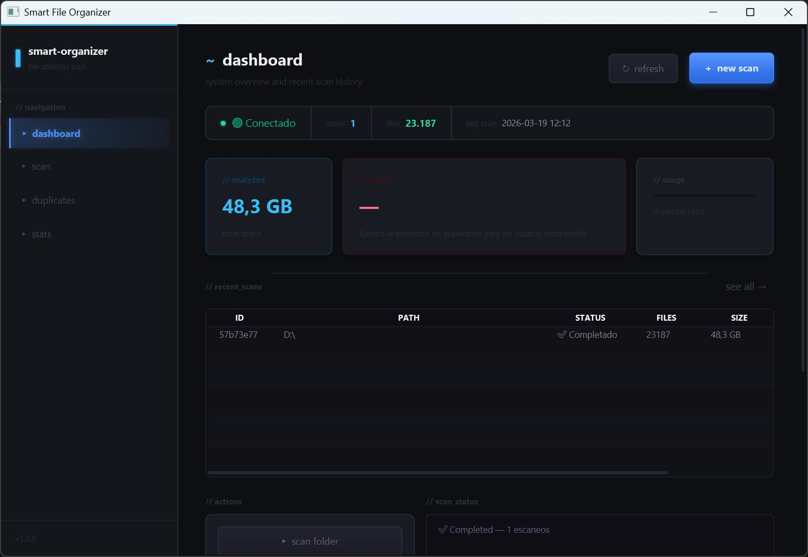
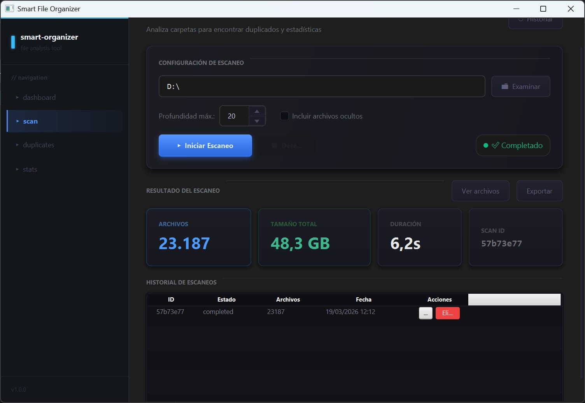
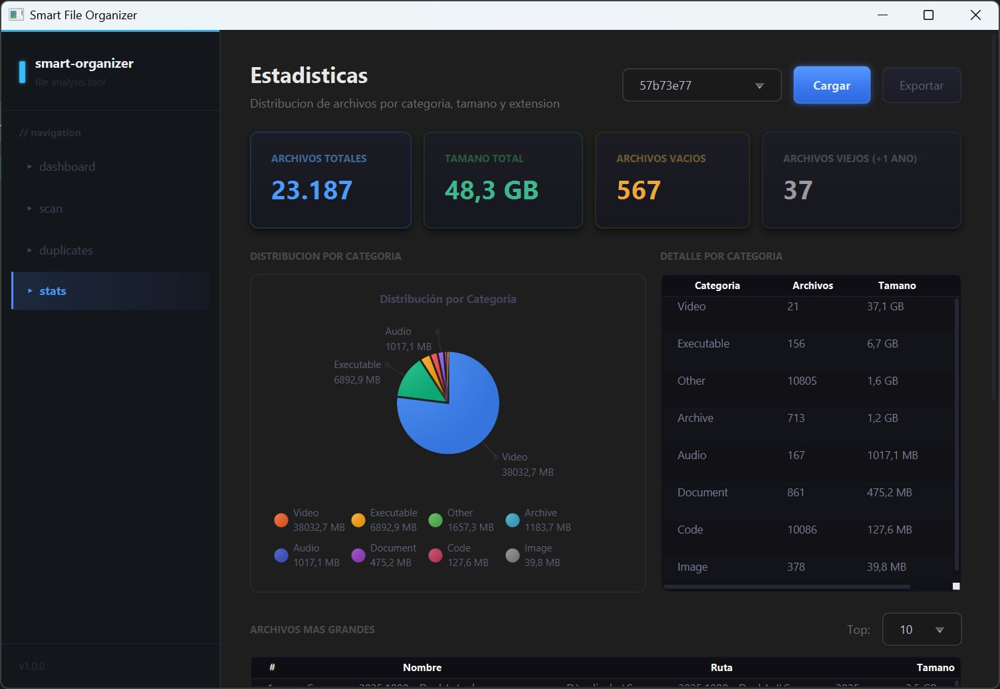

# Smart File Organizer

A cross-platform desktop application for scanning, analyzing, and managing files on your system. Built with a JavaFX frontend and a Python/FastAPI backend communicating in real time via WebSockets.

---

## Screenshots

| Dashboard | Scanner | Statistics |
|-----------|---------|------------|
|  |  |  |

---

## Features

- **Real-time file scanning** with live progress via WebSockets
- **Duplicate detection** using MD5 hashing across the entire directory tree
- **File categorization** — images, documents, video, audio, code, and more
- **Statistics dashboard** with size distribution, top extensions, and largest files
- **Export reports** to PDF, Excel, and CSV with professional formatting
- **Cross-platform path resolution** — works correctly on Windows, Linux, and macOS both natively and inside Docker
- **Persistent scan history** stored in SQLite, rehydrated on restart
- **Iterative directory scanner** using an explicit stack to avoid recursion errors on deeply nested structures

---

## Architecture

```
┌─────────────────────────────────────────────┐
│           JavaFX Desktop Client             │
│  Dashboard · Scanner · Duplicates · Stats   │
│         Java 21 + Maven + OkHttp            │
└──────────────────┬──────────────────────────┘
                   │ REST + WebSocket
┌──────────────────▼──────────────────────────┐
│            FastAPI Backend                  │
│   Scanner · Duplicates · Stats · Export     │
│       Python 3.11 + uvicorn + SQLite        │
└──────────────────┬──────────────────────────┘
                   │
┌──────────────────▼──────────────────────────┐
│              Data Layer                     │
│   SQLite (scan history + file metadata)     │
│   Redis (optional, for pub/sub events)      │
└─────────────────────────────────────────────┘
```

---

## Tech Stack

| Layer | Technology |
|-------|-----------|
| Desktop UI | Java 21, JavaFX, FXML, CSS |
| HTTP Client | OkHttp 4, Gson |
| Backend API | Python 3.11, FastAPI, uvicorn |
| Real-time | WebSockets (FastAPI + JavaFX WebSocketManager) |
| Database | SQLite via custom thread-local connection pool |
| Export | ReportLab (PDF), openpyxl (Excel), csv (CSV) |
| Containerization | Docker, Docker Compose |
| CI/CD | GitHub Actions (Windows `.exe`, macOS `.dmg`, Linux `.AppImage`) |
| Build tools | Maven 3.8, PyInstaller |

---

## Getting Started

### Option 1 — Docker (recommended)

No Java or Python installation required.

```bash
git clone https://github.com/Auder20/Smarth-file-scan.git
cd Smarth-file-scan
cp .env.example .env
docker compose up --build
```

The JavaFX frontend runs inside the container. Make sure your system has a display server available (X11 on Linux, XQuartz on macOS).

> **Note:** On Windows, use Docker Desktop with WSL2. The frontend container requires display forwarding — see the [Docker display setup guide](https://docs.docker.com/desktop/wsl/) for details.

### Option 2 — Native (no Docker)

#### Prerequisites
- Java 21 JDK
- Python 3.11+
- Maven 3.8+
- Redis (optional)

#### Backend
```bash
cd backend
python -m venv .venv
source .venv/bin/activate        # Windows: .venv\Scripts\activate
pip install -r requirements.txt
uvicorn main:app --host 127.0.0.1 --port 8000 --reload
```

#### Frontend
```bash
cd frontend
mvn javafx:run
```

### Option 3 — Build installers locally

| Platform | Command |
|----------|---------|
| Windows | `packaging\build-win.bat` |
| Linux | `bash packaging/build-linux.sh` |
| macOS | `bash packaging/build-mac.sh` |

Scripts auto-detect your environment and install missing dependencies. The macOS script handles both Apple Silicon and Intel architectures.

> **Note:** Pre-built installers are available in [Releases](https://github.com/Auder20/Smarth-file-scan/releases). Windows installer is currently in beta — if it does not launch, use the Docker or native method above.

---

## Project Structure

```
smart-file-organizer/
├── backend/
│   ├── app/
│   │   ├── api/          # FastAPI routers (scanner, duplicates, stats, export, explorer)
│   │   ├── core/         # Scanner engine, hasher, path utils, scan store
│   │   ├── db/           # SQLite connection pool and queries
│   │   └── models/       # Pydantic models
│   ├── tests/            # pytest test suite
│   └── main.py           # FastAPI application entry point
├── frontend/
│   └── src/main/java/com/smartfileorganizer/
│       ├── controllers/  # JavaFX controllers (Dashboard, Scanner, Duplicates, Stats)
│       ├── models/       # Data models (ScanResult, FileInfo, etc.)
│       ├── api/          # ApiClient — HTTP + WebSocket communication
│       └── utils/        # UI utilities, formatting, concurrency helpers
├── packaging/
│   ├── build-win.bat
│   ├── build-linux.sh
│   ├── build-mac.sh
│   └── scripts/          # PyInstaller spec, Inno Setup generator, launcher scripts
├── docs/
│   └── screamshop/       # Screenshots
└── docker-compose.yml
```

---

## API Reference

### Scanner
| Method | Endpoint | Description |
|--------|----------|-------------|
| `POST` | `/api/scan` | Start a new scan |
| `GET` | `/api/scan/{id}/progress` | Get scan progress |
| `GET` | `/api/scan/{id}/files` | Get paginated file list |
| `DELETE` | `/api/scan/{id}` | Cancel or delete a scan |
| `WS` | `/api/scan/ws/scan/{id}` | Real-time progress stream |

### Export
| Method | Endpoint | Description |
|--------|----------|-------------|
| `GET` | `/api/export/{id}?format=pdf` | Export scan as PDF |
| `GET` | `/api/export/{id}?format=excel` | Export scan as Excel |
| `GET` | `/api/export/{id}?format=csv` | Export scan as CSV |
| `GET` | `/api/export/{id}/stats?format=pdf` | Export statistics report |

### Duplicates & Stats
| Method | Endpoint | Description |
|--------|----------|-------------|
| `GET` | `/api/duplicates/{id}` | Get duplicate file groups |
| `GET` | `/api/stats/{id}` | Get scan statistics |
| `GET` | `/api/health` | Health check |

---

## Environment Variables

```env
# Backend
HOST_ROOT=              # Docker volume mount prefix (e.g. /host)
DB_PATH=                # SQLite database path (default: ./smart_file_organizer.db)
LOG_LEVEL=INFO          # Logging level (DEBUG, INFO, WARNING, ERROR)
ALLOWED_ORIGINS=http://localhost:3000,http://127.0.0.1:3000

# Redis (optional)
REDIS_URL=redis://localhost:6379
```

---

## Running Tests

```bash
cd backend
pip install -r requirements.txt
pytest tests/ -v
```

---

## Technical Highlights

**Iterative scanner** — uses an explicit stack instead of recursion to handle directories with thousands of nested levels without hitting Python's recursion limit.

**Batch persistence** — files are written to SQLite in batches of 500 during scanning to avoid data loss on large operations (up to 100,000 files supported).

**Cross-platform path resolution** — `normalize_scan_path()` translates between native OS paths and Docker volume paths transparently, handling Windows (`D:\Users`), Linux (`/home/user`), and Docker-mounted paths (`/host/d/Users`) without duplication.

**State rehydration** — completed scans are reloaded from SQLite into memory on backend restart, so the UI remains consistent across restarts without re-scanning.

**Streaming exports** — CSV export uses Python generators to stream data row by row without loading all files into memory, supporting exports of 100,000+ file scans.

---

## License

MIT License — see [LICENSE](LICENSE) for details.

---

*Built with Java 21 + Python 3.11 · Cross-platform · No installation required (Docker)*